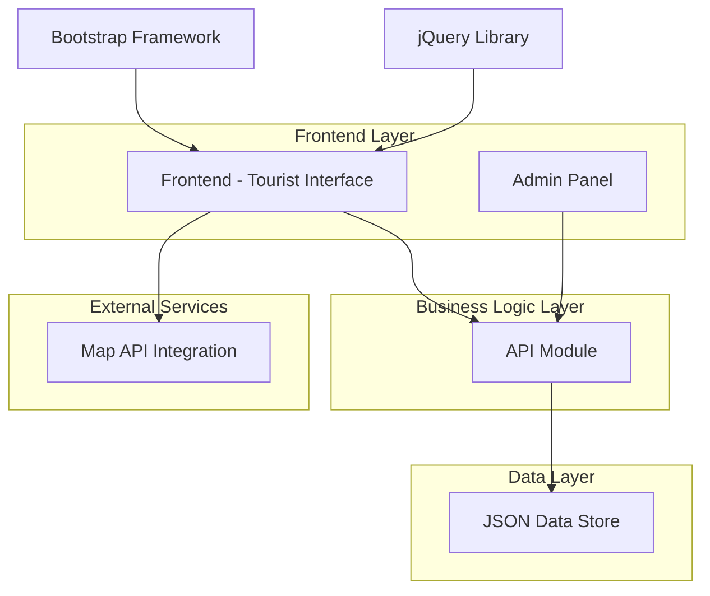

# Design Document

## Overview

The Chiang Mai Tourism Website will be a comprehensive tourism platform built using the same foundation as huaytuengthao.com but expanded to showcase multiple tourist attractions across Chiang Mai. The design maintains the successful visual and structural elements of the reference site while adding advanced functionality for managing and displaying diverse tourism content. The system uses Bootstrap 5.1.3, jQuery, Font Awesome icons, and Itim font to maintain consistency with the reference site's proven approach.

## Architecture

### System Architecture



### Technology Stack

- **Frontend Framework**: Bootstrap 5.x for responsive design
- **JavaScript Library**: jQuery 3.x for DOM manipulation and AJAX
- **Data Storage**: JSON files for attraction data
- **Map Integration**: Google Maps API or OpenStreetMap
- **Server**: Static file server or lightweight Node.js server for API endpoints

## Components and Interfaces

### 1. Frontend Components (Based on huaytuengthao.com Structure)

#### Homepage Component
- **Navigation Bar**: Dark Bootstrap navbar with logo and Thai text (same structure as reference site)
- **Carousel Slider**: 4-slide carousel with overlay text and navigation controls (exact same implementation)
- **News Marquee**: Scrolling announcement bar with red "ประกาศ" label (same styling)
- **Service Section**: 3-column layout with Font Awesome icons and descriptions (expanded for categories)
- **Featured Content Grid**: 4-column layout with images and links (adapted for multiple attractions)
- **News/Updates Table**: Structured content table with dates and links
- **Gallery Section**: Image grid layout for showcasing attractions
- **Footer**: Simple footer with copyright and visitor counter

#### Attractions Listing Component
- **Category Filter Cards**: Expand the 3-column service section to show attraction categories
- **Attraction Grid**: Use the reference site's 4-column image grid layout
- **Search Integration**: Add search functionality to the existing navigation structure
- **Pagination**: Bootstrap pagination component for large attraction lists

#### Attraction Detail Component
- **Content Layout**: Use the reference site's container-based content structure
- **Image Display**: Implement gallery similar to the reference site's image sections
- **Information Panel**: Follow the reference site's text content formatting
- **Map Integration**: Embed Google Maps similar to the contact page implementation
- **Navigation**: Maintain the same navbar structure across all pages

### 2. Admin Components (New Addition to Reference Site)

#### Admin Dashboard
- **Same Visual Style**: Use the reference site's Bootstrap dark navbar and container styling
- **Statistics Cards**: 3-column layout similar to the service section for displaying attraction counts
- **Management Table**: Use the reference site's news table structure for listing attractions
- **Quick Actions**: Bootstrap buttons with Font Awesome icons matching the reference site's style

#### Attraction Management Form
- **Form Layout**: Use Bootstrap form components with the same styling as the reference site
- **Thai Language Support**: Implement Itim font for Thai text input
- **Image Upload**: File upload interface with preview functionality
- **Validation**: Bootstrap validation classes with custom error messages
- **Save Actions**: Bootstrap buttons matching the reference site's color scheme

### 3. API Module Design

#### Endpoints Structure
```javascript
// GET endpoints
GET /api/attractions - Retrieve all attractions
GET /api/attractions/:id - Get specific attraction
GET /api/attractions/category/:category - Filter by category

// POST endpoints (Admin only)
POST /api/attractions - Create new attraction
PUT /api/attractions/:id - Update existing attraction
DELETE /api/attractions/:id - Remove attraction
```

#### Data Validation Layer
- Input sanitization for all form data
- Required field validation
- Image file type and size validation
- Coordinate validation for map integration

## Data Models

### Attraction Data Model
```json
{
  "id": "string (unique identifier)",
  "name": "string (attraction name)",
  "description": "string (detailed description)",
  "category": "string (cultural|natural|wellness|festival|other)",
  "location": {
    "address": "string",
    "coordinates": {
      "lat": "number",
      "lng": "number"
    }
  },
  "images": [
    {
      "url": "string",
      "alt": "string",
      "isPrimary": "boolean"
    }
  ],
  "contact": {
    "phone": "string (optional)",
    "website": "string (optional)",
    "email": "string (optional)"
  },
  "openingHours": "string (optional)",
  "entryFee": "string (optional)",
  "tags": ["array of strings"],
  "createdAt": "timestamp",
  "updatedAt": "timestamp"
}
```

### Category Configuration
```json
{
  "categories": [
    {
      "id": "cultural",
      "name": "Cultural Sites",
      "description": "Temples, museums, historical sites",
      "icon": "fas fa-temple"
    },
    {
      "id": "natural",
      "name": "Natural Attractions",
      "description": "Parks, waterfalls, mountains",
      "icon": "fas fa-mountain"
    },
    {
      "id": "wellness",
      "name": "Wellness",
      "description": "Spas, meditation centers",
      "icon": "fas fa-spa"
    },
    {
      "id": "festival",
      "name": "Festivals & Events",
      "description": "Cultural events and celebrations",
      "icon": "fas fa-calendar-alt"
    }
  ]
}
```

## Error Handling

### Frontend Error Handling
- **Network Errors**: Display user-friendly messages for connection issues
- **Validation Errors**: Real-time form validation with clear error messages
- **404 Errors**: Custom page for non-existent attractions
- **Loading States**: Skeleton screens and loading indicators

### Backend Error Handling
- **Data Validation**: Comprehensive input validation with detailed error responses
- **File Operations**: Error handling for JSON file read/write operations
- **API Responses**: Standardized error response format
```json
{
  "success": false,
  "error": {
    "code": "VALIDATION_ERROR",
    "message": "User-friendly error message",
    "details": ["Specific validation errors"]
  }
}
```

## Testing Strategy

### Unit Testing
- **API Module**: Test all CRUD operations and data validation
- **Data Models**: Validate JSON schema compliance
- **Utility Functions**: Test helper functions for data manipulation

### Integration Testing
- **API Endpoints**: Test complete request-response cycles
- **File Operations**: Test JSON file read/write operations
- **Map Integration**: Test coordinate validation and map display

### User Acceptance Testing
- **Navigation Flow**: Test user journey from homepage to attraction details
- **Admin Workflow**: Test complete attraction management process
- **Responsive Design**: Test across different device sizes
- **Cross-browser Compatibility**: Test on major browsers

### Performance Testing
- **Page Load Times**: Ensure fast loading of attraction listings
- **Image Optimization**: Test image loading and display performance
- **API Response Times**: Monitor API endpoint performance

## UX/UI Design Improvements

### Analysis of Reference Website (huaytuengthao.com)

After analyzing the Huay Tueng Thao tourism website, I can see it's a well-structured Bootstrap-based site for a single tourist attraction. Here are the key observations:

**Positive Aspects of Reference Website:**
- Clean Bootstrap 5 implementation with responsive design
- Effective use of carousel slider for showcasing different activities
- Good visual hierarchy with clear sections (services, news, gallery)
- Thai language support with appropriate fonts (Itim font)
- Interactive elements like video content and image galleries
- News/announcement system with marquee scrolling
- Contact information and social media integration

### Identified Areas for Enhancement
1. **Single Location Focus**: The site showcases only one attraction (Huay Tueng Thao) rather than multiple Chiang Mai destinations
2. **Limited Categorization**: No filtering system for different types of activities or attractions
3. **Basic Content Management**: Static content without dynamic admin system for updates
4. **No Advanced Search**: Missing search functionality across content
5. **Limited Map Integration**: No interactive mapping for location discovery

### Design Solutions

#### 1. Enhanced Visual Design (Building on huaytuengthao.com)
- **Bootstrap 5 Foundation**: Use the same Bootstrap 5 framework as the reference site for consistency
- **Carousel Implementation**: Adopt the effective carousel slider approach for showcasing multiple attractions
- **Thai Typography**: Implement similar Thai font support (Itim or similar) for local content
- **Color Scheme**: Expand the natural, tourism-friendly color palette to accommodate diverse attraction categories
- **Card-Based Layout**: Use the reference site's card approach but extend it for multiple attractions
- **Visual Hierarchy**: Maintain the clean section-based layout (hero, services, gallery, news)

#### 2. Comprehensive Information Architecture
```
Homepage
├── Hero Section (Welcome + Search)
├── Featured Attractions
├── Browse by Category
└── About Chiang Mai

Attractions
├── Filter Sidebar
│   ├── By Category
│   ├── By Location
│   └── By Rating
├── Search Results
└── Attraction Cards

Attraction Detail
├── Image Gallery
├── Description & Info
├── Location Map
├── Contact Details
└── Related Attractions

Admin Panel
├── Dashboard
├── Manage Attractions
│   ├── Add New
│   ├── Edit Existing
│   └── Delete
└── Settings
```

#### 3. Enhanced Interactive Elements (Building on Reference Site)
- **Multi-Attraction Carousel**: Extend the single carousel to showcase multiple attractions
- **Category-Based Services**: Expand the 3-column service section to show different attraction categories
- **Enhanced Gallery**: Build upon the image gallery concept with lightbox and filtering capabilities
- **News System**: Adopt the scrolling news/announcement system for tourism updates
- **Video Integration**: Extend the video content approach for multiple attractions
- **Interactive Navigation**: Improve upon the navbar with search and filtering capabilities
- **Admin Panel**: Add backend functionality that the reference site lacks

#### 4. Responsive Design Strategy (Improving on Reference Site)
- **Mobile-First Approach**: Enhanced mobile experience building on reference site's foundation
- **Breakpoint Strategy**: 
  - Mobile: 320px - 768px (optimized for attraction browsing)
  - Tablet: 768px - 1024px (enhanced filtering and map view)
  - Desktop: 1024px+ (full-featured admin panel and detailed views)
- **Touch-Friendly**: Large tap targets optimized for attraction selection and filtering
- **Progressive Enhancement**: Core functionality works without JavaScript, enhanced features with it

#### 5. Content Strategy Improvements
- **Multi-Attraction Platform**: Scale the single-location approach to showcase all Chiang Mai attractions
- **Category Services**: Expand the reference site's service icons to represent attraction categories
- **Dynamic News System**: Build upon the announcement system for tourism updates across all attractions
- **Enhanced Gallery Structure**: Organize images by attraction and category, not just single location
- **Comprehensive Information**: Provide detailed attraction data similar to the reference site's depth
- **Admin Content Management**: Add the missing backend functionality for dynamic content updates

#### 6. Technical Implementation Strategy (Exact Reference Site Foundation)

**Core Technologies (Same as Reference Site):**
- **Bootstrap 5.1.3**: Exact same CDN links and version
- **Font Awesome 5.10.0**: Same icon library and version
- **Itim Font**: Google Fonts integration for Thai language support
- **jQuery/Popper**: Same JavaScript libraries for interactivity

**Page Structure Template (Based on Reference Site):**
```html
<!DOCTYPE html>
<html lang="en">
<head>
    <!-- Same meta tags and CDN links as reference site -->
    <link href="https://cdn.jsdelivr.net/npm/bootstrap@5.1.3/dist/css/bootstrap.min.css" rel="stylesheet">
    <link rel="stylesheet" href="https://pro.fontawesome.com/releases/v5.10.0/css/all.css">
    <link href="https://fonts.googleapis.com/css2?family=Itim&display=swap" rel="stylesheet">
</head>
<body>
    <!-- Same navbar structure -->
    <nav class="navbar navbar-expand-sm navbar-dark bg-dark">
        <!-- Logo and navigation items -->
    </nav>
    
    <!-- Same carousel structure for hero section -->
    <section id="slider">
        <div class="carousel slide" data-bs-ride="carousel">
            <!-- Carousel content -->
        </div>
    </section>
    
    <!-- Same news marquee -->
    <div class="d-flex justify-content-between align-items-center breaking-news navbar-expand-sm navbar-dark bg-dark">
        <!-- Scrolling news content -->
    </div>
    
    <!-- Same service section structure -->
    <section id="service" class="py-0">
        <div class="container">
            <div class="row">
                <!-- 3-column layout with icons -->
            </div>
        </div>
    </section>
    
    <!-- Same footer -->
    <footer class="text-center p-4">
        <!-- Copyright and counter -->
    </footer>
</body>
</html>
```

**CSS Styling Approach:**
- Use the reference site's custom CSS classes and styling
- Maintain the same color scheme and visual hierarchy
- Extend existing styles for new functionality rather than replacing them

## Map Integration Design (Following Reference Site Pattern)

### Google Maps Integration (Same as Contact Page)
- **Embed Implementation**: Use the same iframe embed approach as the reference site's contact page
- **Responsive Design**: Same responsive map sizing and Bootstrap grid integration
- **Multiple Locations**: Extend the single location approach to show multiple attractions
- **Custom Markers**: Add markers for different attraction categories while maintaining the same visual style

### Map Features (Enhanced from Reference Site)
- **Individual Attraction Maps**: Each attraction detail page has its own embedded map (like contact page)
- **Main Map Page**: Overview map showing all attractions with category-based markers
- **Consistent Styling**: Use the same iframe styling and container structure as the reference site
- **Mobile Responsive**: Follow the reference site's responsive map implementation

**Map Implementation Example (Based on Reference Site):**
```html
<div class="col-md-8 text-center mb-4">
    <iframe src="https://www.google.com/maps/embed?pb=..." 
            width="800" height="500" 
            style="border:0;" 
            allowfullscreen="" 
            loading="lazy">
    </iframe>
</div>
```