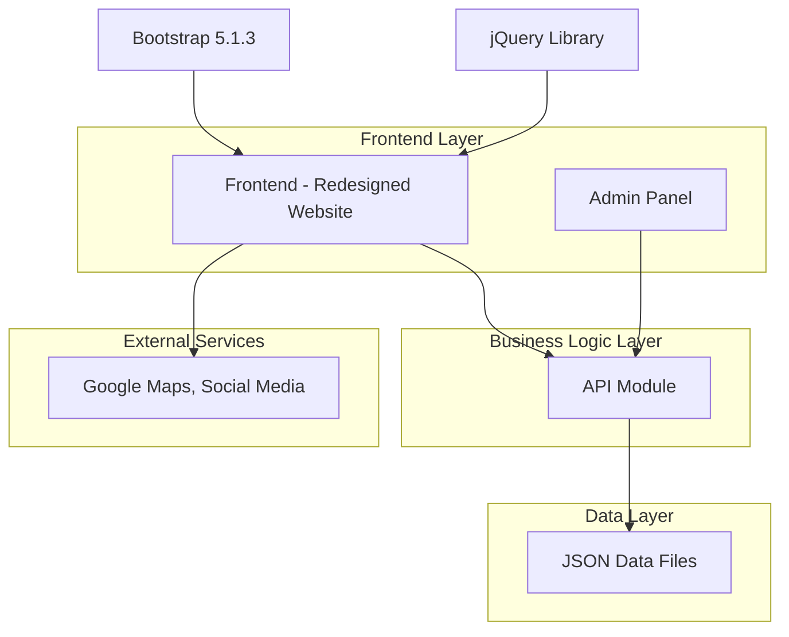

# Design Document

## Overview

The Huay Tueng Thao Website Redesign project aims to create a modern, visually enhanced version of the existing tourism website (https://huaytuengthao.com/) while maintaining its successful content structure and functionality. The redesign will extract all existing content into organized JSON files and implement an administrative system for content management. The project uses the same technical foundation (Bootstrap 5.1.3, jQuery, Font Awesome, Itim font) while significantly improving the visual design and user experience.

## Architecture

### System Architecture



### Technology Stack (Same as Original)

- **Frontend Framework**: Bootstrap 5.1.3 (exact same version)
- **JavaScript Library**: jQuery for DOM manipulation and AJAX
- **Icons**: Font Awesome 5.10.0 (same version)
- **Typography**: Itim font for Thai language support
- **Data Storage**: JSON files organized by page and content section
- **Map Integration**: Google Maps iframe embed (same implementation)

## Components and Interfaces

### 1. Frontend Components (Enhanced Versions of Original)

#### Homepage Component (Enhanced index.html)
- **Navigation Bar**: Same structure with improved styling and animations
- **Carousel Slider**: Same 4-slide carousel with enhanced visual effects and smoother transitions
- **News Marquee**: Same scrolling announcement with improved typography and colors
- **Service Section**: Same 3-column layout with enhanced card design and hover effects
- **Featured Content**: Same 4-column grid with improved image handling and layout
- **News Table**: Same table structure with better typography and responsive design
- **Gallery Section**: Same image grid with lightbox functionality and improved loading
- **Footer**: Same footer with enhanced styling and better mobile responsiveness

#### History Page Component (Enhanced page-history.html)
- **Content Layout**: Same container-based structure with improved typography and spacing
- **Historical Images**: Enhanced image display with better positioning and captions
- **Text Content**: Improved readability with better font sizing and line spacing
- **Timeline Display**: Visual enhancements to historical timeline presentation

#### Services Page Component (Enhanced page-services.html)
- **Service Information**: Same content structure with improved visual presentation
- **Activity Descriptions**: Enhanced layout for better content organization
- **Service Images**: Improved image galleries and positioning

#### Contact Page Component (Enhanced page-contact.html)
- **Contact Information**: Same information with improved typography and layout
- **Google Maps**: Same iframe implementation with enhanced responsive design
- **Social Media Integration**: Same Facebook integration with improved styling

### 2. Admin Components (New Addition)

#### Admin Authentication System
- **Login Interface**: Simple, secure login form using Bootstrap styling
- **Session Management**: Basic session handling for admin access
- **Security Features**: Password protection and session timeout

#### Admin Dashboard
- **Content Overview**: Statistics showing content status across all JSON files
- **Quick Edit Actions**: Direct access to commonly edited content sections
- **File Status Monitor**: Display current status of all JSON files
- **Recent Changes Log**: Track recent content modifications

#### Content Management Interface
- **Homepage Content Editor**: Forms for editing carousel, services, featured content, and news
- **Page Content Editors**: Dedicated editors for history, services, news, about, and contact pages
- **Image Management**: Upload, organize, and manage images for all content sections
- **JSON File Editor**: Direct editing interface for JSON files with validation

### 3. API Module Design (New Addition)

#### Endpoints Structure
```javascript
// GET endpoints for content retrieval
GET /api/content/homepage - Retrieve homepage content
GET /api/content/history - Get history page content
GET /api/content/services - Get services information
GET /api/content/contact - Get contact information

// POST endpoints for admin content updates
POST /api/admin/update/homepage - Update homepage content
POST /api/admin/update/history - Update history content
POST /api/admin/update/contact - Update contact information
POST /api/admin/upload/image - Upload new images
```

#### Data Management Layer
- **JSON File Operations**: Read/write operations for all content files
- **Data Validation**: Ensure content integrity and proper formatting
- **Backup System**: Automatic backup of JSON files before updates
- **Error Handling**: Comprehensive error handling for file operations

## Data Models

### JSON File Structure

#### Homepage Content (data/homepage-carousel.json)
```json
{
  "slides": [
    {
      "id": 1,
      "title": "พ่อ แม่ ลูก",
      "description": "พ่อตึงเฒ่า แม่ขวัญข้าว น้องแรมเพจ ครบทีม พ่อแม่ลูกแห่งห้วยตึงเฒ่า",
      "backgroundImage": "carousel-image-1.jpg",
      "active": true
    }
  ]
}
```

#### Services Content (data/homepage-services.json)
```json
{
  "services": [
    {
      "id": 1,
      "icon": "fas fa-bullhorn",
      "title": "ประกาศ",
      "description": "ห้วยตึงเฒ่าของเรา เปิดให้บริการทุกวันไม่มีวันหยุด ตั้งแต่เวลา 06:30 - 18:00 น."
    }
  ]
}
```

#### Contact Information (data/contact-content.json)
```json
{
  "organization": "สำนักงานโครงการจัดหมู่บ้านตัวอย่างห้วยตึงเฒ่า อันเนื่องมาจากพระราชดำริ",
  "address": "283 ม.3 ต.ดอนแก้ว อ.แม่ริม จ.เชียงใหม่ 50180",
  "phone": "053-121119",
  "email": "hueytuengtao@hotmail.com",
  "socialMedia": {
    "facebook": "https://www.facebook.com/huaytuengthao/",
    "fanpage": "https://www.facebook.com/huaytuengthaocm"
  },
  "mapEmbed": "https://www.google.com/maps/embed?pb=..."
}
```

## Error Handling

### Frontend Error Handling
- **Content Loading**: Graceful handling of JSON loading failures with fallback content
- **Image Loading**: Progressive image loading with placeholder images
- **Navigation**: Smooth error handling for broken links or missing pages
- **Responsive Design**: Fallback layouts for unsupported screen sizes

### Backend Error Handling
- **File Operations**: Comprehensive error handling for JSON file read/write operations
- **Data Validation**: Input validation with user-friendly error messages
- **Admin Authentication**: Secure error handling for login attempts
- **API Responses**: Standardized error response format

## Testing Strategy

### Visual Regression Testing
- **Design Comparison**: Compare redesigned pages with original site functionality
- **Cross-Browser Testing**: Ensure consistent appearance across major browsers
- **Responsive Testing**: Verify improved mobile experience across device sizes
- **Performance Testing**: Ensure redesign doesn't impact loading performance

### Content Management Testing
- **Admin Workflow**: Test complete content editing and publishing workflow
- **JSON File Integrity**: Validate JSON file structure after admin updates
- **Real-time Updates**: Verify frontend immediately reflects admin changes
- **Backup and Restore**: Test backup system functionality

## UX/UI Design Improvements

### Visual Hierarchy Enhancement
- **Typography Scale**: Implement consistent typography hierarchy with improved font sizes and spacing
- **Color Contrast**: Enhance color contrast ratios for better accessibility
- **Content Sectioning**: Use cards, borders, and spacing to create clear content sections
- **Visual Flow**: Guide user attention through improved layout and visual cues

### Color Scheme Development
- **Nature-Inspired Palette**: Develop colors that reflect Huay Tueng Thao's natural beauty
- **Brand Consistency**: Create cohesive color scheme across all pages
- **Accessibility Compliance**: Ensure all color combinations meet WCAG guidelines
- **Emotional Connection**: Use colors that evoke feelings of nature and tranquility

### Mobile-First Responsive Design
- **Touch Optimization**: Larger touch targets and improved mobile navigation
- **Content Prioritization**: Show most important content first on mobile devices
- **Image Optimization**: Responsive images that load efficiently on mobile networks
- **Navigation Simplification**: Streamlined mobile menu with easy access to key sections

### Interactive Elements Enhancement
- **Smooth Animations**: CSS transitions and jQuery animations for better user engagement
- **Hover Effects**: Subtle hover effects on interactive elements
- **Loading States**: Improved loading indicators and skeleton screens
- **Feedback Systems**: Visual feedback for user interactions and form submissions

## Implementation Strategy

### Phase 1: Content Extraction and JSON Structure
- Extract all content from original website
- Organize content into logical JSON file structure
- Create data models for each content type
- Implement basic API for content retrieval

### Phase 2: Frontend Redesign
- Recreate all pages with enhanced visual design
- Implement responsive improvements
- Add interactive elements and animations
- Integrate with JSON data sources

### Phase 3: Admin System Development
- Build admin authentication system
- Create content management interfaces
- Implement JSON file editing capabilities
- Add image management functionality

### Phase 4: Integration and Testing
- Connect admin system with frontend updates
- Implement real-time content synchronization
- Conduct comprehensive testing
- Performance optimization and final polish